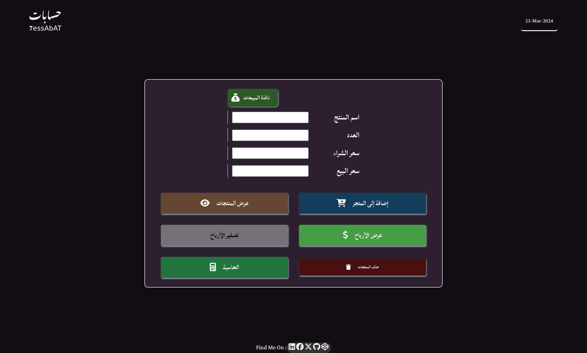
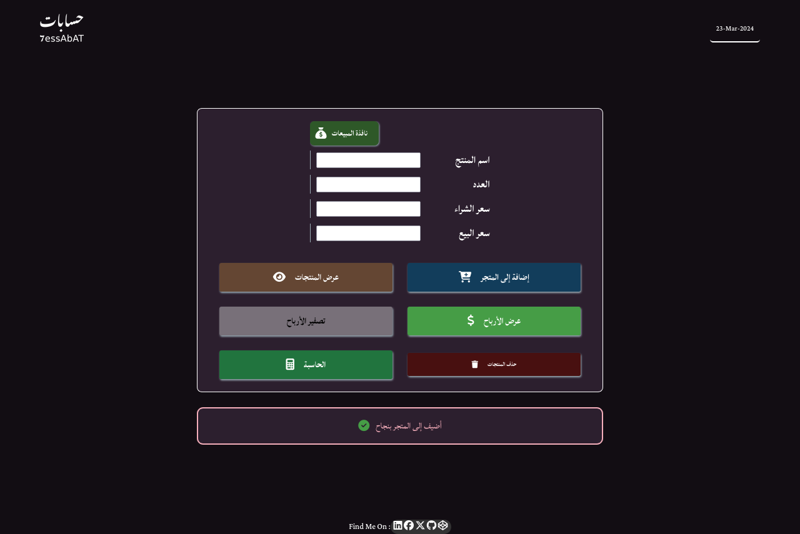
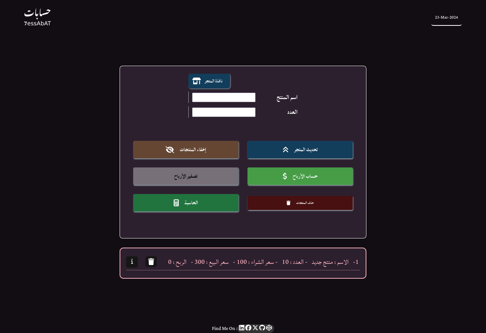
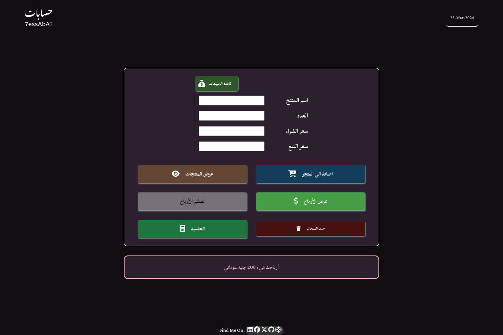
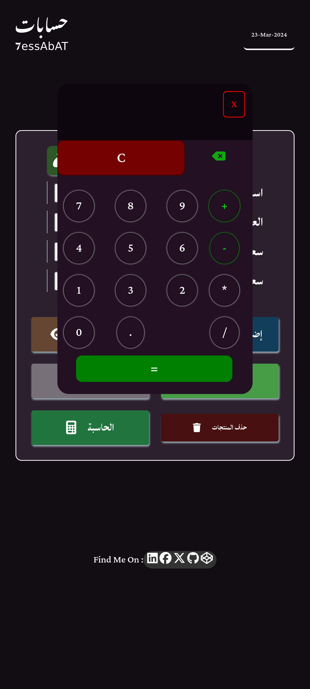
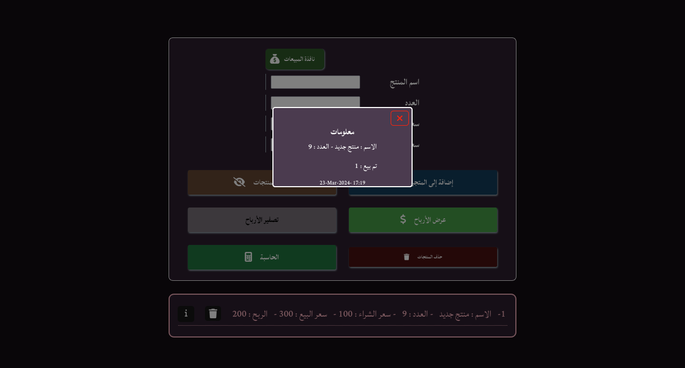
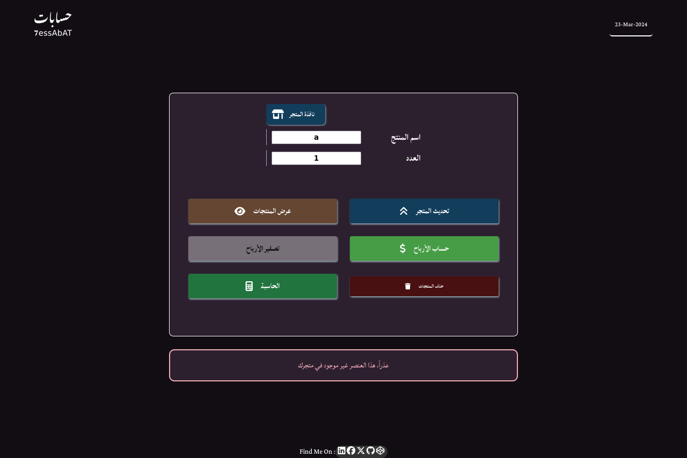
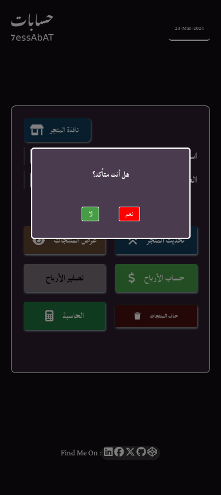

# 7essAbAt Web Application

#### 7essabat in Arabic mean (Calculations)
*******
###  7essAbAt is a web application build with:
- HTML5
- CSS3 (SASS preprocessor)
- Vanilla JavaScript

#### It's built to calculate the profits for small personal business.

#### The app is installable which mean is a Progressive Web Application (PWA) which can run on Mobile offline,you only need internet to open the app.

******
# Basic App Functions

1. Add item to stack with its name,number of item,price and Sell price.

2. Update stack if you sold one of your proudcts

3. calculate profit 

4. Remove all data in stack

5. Using simple Calculator

# Advanced Feauters
1. Date on the top of app page

2. Show & hide Data in stack

3. Open sells window.

4. Set all proifts to zero in case something went wrong or you want to calc every single day's profit alone.

5. show error message if you enter words in numeric fields.

6.  Show message if you try to calc profit for item which has 0 number.

# screenshots

### Desktop :
-------
1. ### new design 

*********
2. #### new item

******
3. #### success message

********
4. #### Data

******
5. #### Sells Window

*********
6. #### Update Stack

*********
7. #### profit

*********
8. #### Caclulator

********
9. #### Info popup

********
10. #### Error message

********
11. #### Remove popup

    